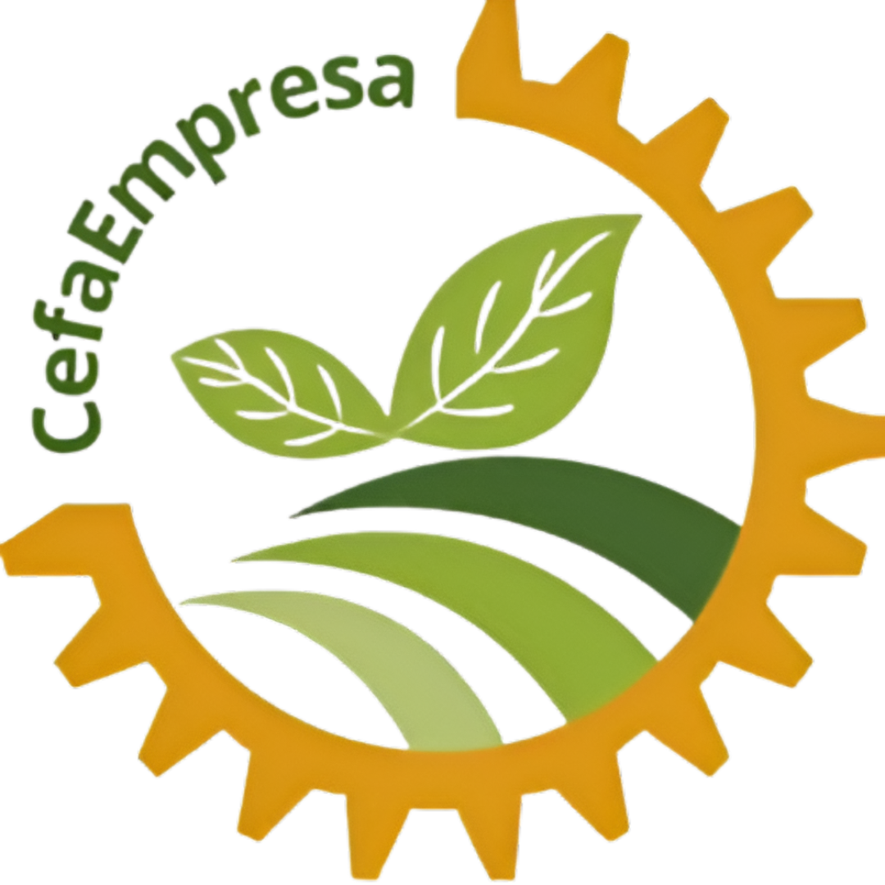
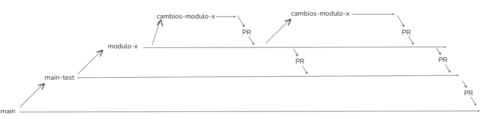

# ERP-CEFAEMPRESA

<p align="center">
  
</p>

Bienvenido al repositorio de **ERP-CEFAEMPRESA**, un sistema de **Enterprise Resource Planning (Planificación de Recursos Empresariales)** desarrollado para apoyar a **SENA Empresa**, ubicada en el Centro de Formación Agroindustrial.  

Este proyecto busca **automatizar y digitalizar los procesos internos** de la organización, optimizando la gestión y mejorando la eficiencia en sus operaciones diarias.  


---

## 🎯 Objetivo

El propósito principal de este ERP es **brindar una solución integral para la gestión de recursos empresariales en SENA Empresa**, contribuyendo a:  

- Automatización de procesos internos.  
- Digitalización de la información.  
- Escalabilidad y adaptabilidad a nuevas necesidades.  
- Organización modular que facilita la mantenibilidad y evolución del sistema.  

---

## 📌 Estado del proyecto

Este proyecto se encuentra en constante desarrollo y mejora. Cualquier aporte, sugerencia o retroalimentación es bienvenida para fortalecer el sistema y su impacto en la organización.  

---

# Metodologia de trabajo

Se utilizara GitHub para almacenar el proyecto y diversificar sus verciones manteniendo el control de estas
de una manera organizada y profecional. 

Se utilizara Git para poder manejar las verciones y peticiones hacia GitHub

Lo que utilizaremos son "Issues" para hacer peticiones a los desarolladores sobre que tienen que desarollar 

Se utiilizaran PRs (Pull request) para que los desarolladores hagan marge (cambios de rama a rama) sobre las ramas 


## Flujo de trabajo con ramas 

Los desarrolladores que trabajen sobre un módulo deben crear una rama con el nombre del módulo.
De esta rama se podrán derivar otras ramas secundarias para realizar cambios específicos sobre el mismo módulo.

Todas las integraciones se harán mediante Pull Requests (PRs).

Cuando la rama del módulo esté lista para ser enviada a producción, se deberá crear una PR hacia la rama main-test.
La rama main-test funciona como un espejo de main, y sirve para verificar y probar los cambios antes de enviarlos definitivamente a producción.

Una vez validados los cambios en main-test, se podrá crear la PR final hacia main, que representa el código en producción.


<p align="center">
  
</p>


---

# 🚀 Tecnologías utilizadas

El proyecto está construido como un **monolito escalable** en **Laravel v12**, gracias a la integración de las siguientes herramientas y paquetes:

1. **[Filament v4](https://github.com/filamentphp/filament)** – Panel administrativo moderno y altamente personalizable.  
2. **[Laravel Modules v12](https://github.com/nWidart/laravel-modules)** – Arquitectura modular para organizar y escalar el proyecto.  
3. **[Filament en Módulos (coolsam/modules) v5](https://github.com/savannabits/filament-modules/blob/main/README.md)** – Integración de Filament con módulos para mayor flexibilidad.  
4. **[Roles y Permisos (Filament Shield v4)](https://github.com/bezhanSalleh/filament-shield)** – Gestión avanzada de accesos basada en roles y permisos.  


|               |          |          |                              |
|---------------|----------|----------|------------------------------|
| php           |          |          |                              |
| node npm      |          |          |  filament-module             |
| mysql         | Laravel  | Filament |                              |
| composer      |          |          |  filament-roles-permissions  |
| sqlite        |          |          |                              |


# 📖 Documentación

El proyecto dispone de una carpeta llamada documentacion ubicada en la raíz del repositorio.
En ella encontrarás toda la información necesaria para comprender y trabajar en el proyecto de manera eficiente.

Esta carpeta está organizada para que puedas acceder fácilmente a:

📌 Guías por módulos: explicación detallada del funcionamiento de cada módulo del sistema.

📌 Información relevante: aspectos generales del proyecto que todo desarrollador debe conocer.

📌 Tutoriales de tecnologías: material de apoyo para aprender o reforzar el uso de las herramientas empleadas.

📌 Solución de problemas: recopilación de errores comunes y sus pasos de resolución.

En resumen, la carpeta de documentación es el punto de referencia principal para desarrolladores nuevos y existentes,
 asegurando un acceso rápido y ordenado a todo el conocimiento del proyecto.

Estos links proporcionan de manera detallada todo lo que necesitas saber para manipular el proyecto

1. **[Instalación del proyecto](https://github.com/Andres020Mi/CEFAEMPRESA-ERP/blob/main/documentacion/v2/instalacion%20y%20despliegue.md)**
2. **[Crear un modulo dentro del proyecto sin filament](https://github.com/Andres020Mi/CEFAEMPRESA-ERP/blob/main/documentacion/v2/modulos.md)**
3. **[Implementación de filament dentro de un modulo o creacion de modulo con filament](https://github.com/Andres020Mi/CEFAEMPRESA-ERP/blob/main/documentacion/v2/modulos-filament.md)**
4. **[Creación de panneles en un modulo con filament](https://github.com/Andres020Mi/CEFAEMPRESA-ERP/blob/main/documentacion/v2/modulos-filament-paneles.md)**
5. **[Creación de resources dentro de un panel que se encunetre en un modulo](https://github.com/Andres020Mi/CEFAEMPRESA-ERP/blob/main/documentacion/v2/modulos-filament-resource.md)**

# **Instalacion y despliegue del proyecto**

Este documento contiene los pasos necesarios para instalar y desplegar el proyecto para que empieces a trabajar en el.

Asegúrate de tener instaladas las siguientes tecnologías en tu máquina:

- [PHP 8.2+](https://www.php.net/)
- [Composer](https://getcomposer.org/)
- [Node.js 20+ y NPM](https://nodejs.org/)
- [MySQL 8+](https://dev.mysql.com/downloads/mysql/)
- [Git](https://git-scm.com/)

Estos servicios puedes obtenerlos con gestores de servicios como **laragon** , **Xampp**, desde su terminal puedes ejecutar los comandos que veras en este documento.

---

## ( 1 ) **Clonar el repocitorio**

Este comando te creara una carpeta llamada cefaempresa
```bash
git clone https://github.com/Andres020Mi/CEFAEMPRESA-ERP.git
```

Si quisieras descargar una rama en especifico del repo puedes utiliza el siguente comando.
```bash
git clone --branch <rama> https://github.com/Andres020Mi/CEFAEMPRESA-ERP.git
```

Si quieres que el proyecto se descargue con un nombre distinto para evitar conflictos de nombres ya existentes puedes utilizar el siguente comando para nombrar el proyecto como quieras.
```bash
git clone https://github.com/Andres020Mi/CEFAEMPRESA-ERP.git <nombre-carpeta>
```

---

## ( 2 ) **Ingresar al proyecto**

Es importa estar en la raiz del proyecto ya que desde ahi tendras que ejecutar comandos que te permitan utilizar de manera decuada este proyecto.

Desde la terminal puedes ingresar a la carpeta creada utilizando el siguente comando.
```bash
cd CEFAEMPRESA-ERP
```

lo que veras dentro es algo asi 

```bash
CEFAEMPRESA-ERP/
├── app/
│   ├── Console/
│   ├── Exceptions/
│   ├── Http/
│   │   ├── Controllers/
│   │   ├── Middleware/
│   │   └── Kernel.php
│   ├── Models/
│   └── Providers/
│       ├── AppServiceProvider.php
│       ├── AuthServiceProvider.php
│       ├── BroadcastServiceProvider.php
│       ├── EventServiceProvider.php
│       └── RouteServiceProvider.php
│
├── bootstrap/
│   └── app.php
│
├── config/
│   └── *.php
│
├── database/
│   ├── factories/
│   ├── migrations/
│   └── seeders/
│
├── lang/
│   └── en/
│
├── public/
│   ├── index.php
│   └── favicon.ico
│
├── resources/
│   ├── css/
│   ├── js/
│   └── views/
│
├── routes/
│   ├── api.php
│   ├── channels.php
│   ├── console.php
│   └── web.php
│
├── storage/
│   ├── app/
│   ├── framework/
│   └── logs/
│
├── tests/
│   ├── Feature/
│   └── Unit/
│
├── vendor/
│
├── .editorconfig
├── .env.example
├── .gitattributes
├── .gitignore
├── artisan
├── composer.json
├── composer.lock
├── package.json
├── phpunit.xml
├── vite.config.js
└── README.md

```


en caso de que le coloques un nombre distinto a la carpeta puedes utilizarlo asi.
```bash
cd <nombre-carpeta>
```


---

## ( 3 ) **Instalacion de paquetespaquetes de PHP o librerías de Composer y paquetes de Node.js**

Es importante instalar las tecnologias necesarias que necesita el proyecto para funcionar esto se encunetran en los archivos,
composer.json , composer.lock , package-lock.json , package.json.

Puedes instalar todo eso con los siguentes 2 comandos los cuales tienes que ejecutar dentro de la carpeta raiz del proyecto en una terminal co acceso a las tecnologias de **composer** y **npm**.


instalar paquetes de **php**
```bash
composer install
```

instalar paquetes de **node**
```bash
npm install
```

---

## ( 4 ) **Clonación del .env**

Los proyectos necesitan un **.env** En el cual se almacena varibales importantes para que el proyecto funcione, como lo seria la coneccion a la base de datos, **KEY** , configuración de el modo del proyecto.

Este comando lo puedes crear solo si existe el .env.exmaple que debe de estar en la raiz del proyecto, este documento es una base de lo que necesitarias.

lo que aremos es utilizar el .env.exmaple para poder crear un nuevo archivo con su mismo contenido y empezar a trabajar sobre el.

recuerda estar dentro de la raiz del proyecto con una terminal.

```bash
cp .env.exmaple .env
```

---

## ( 5 ) **Crear la llave del proyecto**

Esta llave se encunetra en el .env y se crea para poder utilizarse para sifrar información sensible en el proyecto como seciones o informacion a la que le apligues encriptado.

recuerda estar en la carpeta raiz del proyecto
```bash
php artisan key:generate
```
---

## ( 6 ) **Configuración de la base de datos**
Todo proyecto necesita su base de datos  para funcionar en este caso dejare varios casos que puedes tomar.

### ( 6.1 ) **Con sqlite**
es una base de datos ligera y sin necesidad de descargar mucho, que te puede permitir desplegar tu proyecto mas rapido en **entornos de prueba**.

para poder migrar tu base de datos a este archivo tienes que crearlo ya que el proyecto viene sin el, puedes hacerlo con el siguente comando.

```bash
touch ./database/database.sqlite
```

luego de eso puedes migrar la base de datos con o sin seeders ya que laravel 12 por defecto viene configurado en el .env para trabajar con sqlite.

```bash
DB_CONNECTION=sqlite
# DB_HOST=127.0.0.1
# DB_PORT=3306
# DB_DATABASE=laravel
# DB_USERNAME=root
# DB_PASSWORD=
```

Para migrar todas las tablas del proyecto
```bash
php artisan migrate
```

Si te interesa trabajar volver a refrescar la base de datos desde 0 puedes utilizar esto.
```bash
php artisan migrate:refresh
```


### ( 6.2 ) **Con mysql**

mysql es un base de datos bastante util cunado lo bas a utilizar en produccion o en tu local si necesitas buen rendimiento cuando la base de datos sea demaciado grande.

tienes que ingresar al .env y descomentar las siguentes linas, lo logras quitando los # que se encuntran a la derecha.

tambien cambiale el sqlite por mysql

```bash

# Antes

DB_CONNECTION=sqlite
# DB_HOST=127.0.0.1
# DB_PORT=3306
# DB_DATABASE=laravel
# DB_USERNAME=root
# DB_PASSWORD=

# Despues

DB_CONNECTION=mysql
DB_HOST=127.0.0.1
DB_PORT=3306
DB_DATABASE=name__database
DB_USERNAME=root
DB_PASSWORD=


```


Para migrar todas las tablas del proyecto

```bash
php artisan migrate
```

Si te interesa trabajar volver a refrescar la base de datos desde 0 puedes utilizar esto.
```bash
php artisan migrate:refresh
```


---


## **( 7 ) Roles y permisos**

Este proyecto cuenta con un pligin de filament el cual utilizamos para poder utilizar roles y permisos, para que el super administrador funcione correctamente tienes que ejecutar los siguentes comandos.


este comando scaneara cada permiso que se necesita en cada resource y te preguntara en que panel quieres crear una vista para el super administrador para que este administre los roles y permisos desde ahi.

este comando te ara una serie de preguntas.

1. en que panel quieres crear el administrador de roles y permisos

2. luego preguntara unas cosas relacionada a el tipo de estructura para manejarlo, lo mejor que puedes hacer es dar enter 2 veses para que se guarde con una estructura de por defecto que ya funciona.


```bash
php artisan shield:generate --all
```

---


## **( 8 ) seeders "no recomendado"**

Si quieres migrar lo seeders puedes ejecutar el siguente comando estos comadnos migran todos los seeders existentes en el proyecto.

```bash
php artisan db:seed
```


En caso de que quieras migrar y ejecutar seeder de inmediato puedes utilizar
```bash
php artisan migrate --seed
```

En caso de que quieras refrescar y ejecutar seeder de inmediato puedes utilizar
```bash
php artisan migrate:refresh --seed
```
---


## **( 9 ) seeders modulos**

El proyecto cuenta con una libreria de modulos que permite separar seeders en cada modulo de manera independiente, para ejecutarlos tienes que utilizar el siguente comando.

```bash
php artisan module:seed <nombre-modulo>
```
---


## **( 10 ) Despligue**

Por conveniencia el proyecto usa el siguente comando modificado para ejecutar el proyecto en windos:

```bash
composer run dev:windos
```

En caso de estar en linux puedes ejecutarlo de esta manera
```bash
composer run dev
```


