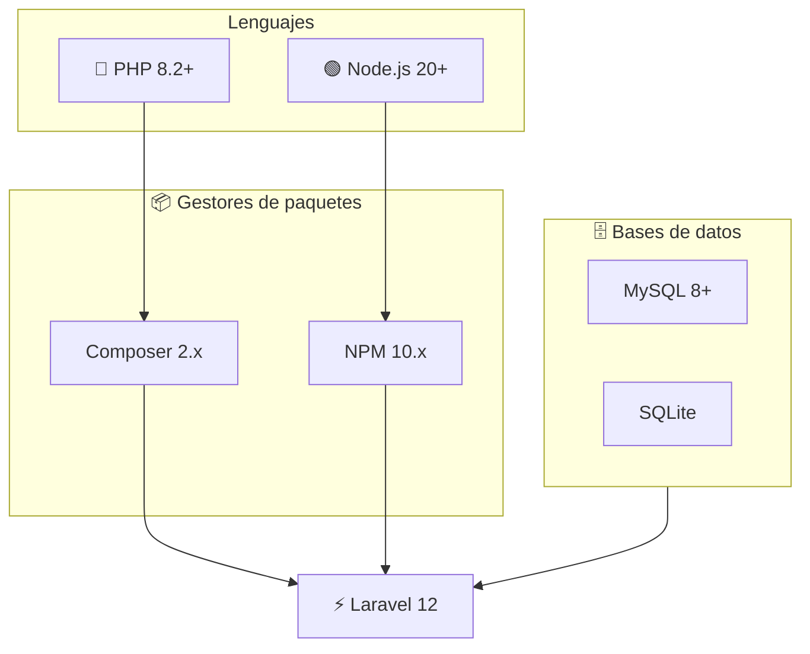
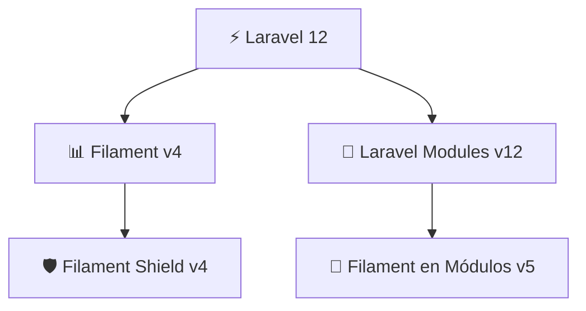

# **CEFAEMPRESA-ERP**

<p align="center">
  
</p>

CEFAEMPRESA-ERP es un ERP  "Enterprise Resource Planning" o Planificación de Recursos Empresariales, que fue creado con el fin de apoyar a SENA Empresa que se encunetra en el centro de formación agroindustrial.

---

# **Metodologias de trabajo**


---

# **Tecnologias utilizadas**


Estas son las bases necesarias para ejecutar el proyecto Laravel:

- [🐘 PHP 8.2+](https://www.php.net/)
- [📦 Composer](https://getcomposer.org/)
- [🟢 Node.js 20+ y NPM](https://nodejs.org/)
- [🗄️ MySQL 8+](https://dev.mysql.com/downloads/mysql/) (o SQLite para entornos ligeros)
- [🌐 Git](https://git-scm.com/)



---

# ⚡ Librerías y plugins de Laravel

El proyecto utiliza las siguientes librerías para potenciar la arquitectura, el panel administrativo y la seguridad:

1. **[Filament v4](https://github.com/filamentphp/filament)** – Panel administrativo moderno y personalizable.  
2. **[Laravel Modules v12](https://github.com/nWidart/laravel-modules)** – Arquitectura modular para escalar el proyecto.  
3. **[Filament en Módulos (coolsam/modules) v5](https://github.com/savannabits/filament-modules)** – Integración de Filament con módulos.  
4. **[Roles y Permisos (Filament Shield v4)](https://github.com/bezhanSalleh/filament-shield)** – Gestión de accesos basada en roles y permisos.  




# **Requerimientos para desplegar el proyecto**


Si quieres instalar el proyecto y ponerlo en funcionamiento en tu computador, vas a necesitas un gestor de servicios que te proporcionen las sigunetes tecnologias, normalmente estos gestores vienen con tecnologias algo viejas, por lo que te recomiendo actualizarla a las verciones que ves en esta documentación.


### **Lenguajes**

- PHP 8.4^

- node 22.10.0^

### **Gestores de paquetes**

- npm 10.9.3^

- composer 2.4.1^


### **base de datos**

- mysql -> recomendado

- sqlite -> rapido, para base de datos pequeñas 


### **Servidor web**

apache httpd 2.4.54


---

# **Instalación y despliegue del proyecto**

Una ves cumplas con todos los requerimientos para desplegar el proyecto puedes empezar con la instalacion y despligue del proyecto, a continuacion se te presenta los pasos junto con consejos para que puedas desplegar el proyecto en tu computador.

Recuerda que todos los comandos que se te presentan tienes que ejecutarlo desde una terminal con acceso a las tecnologias que te pedimos, lo normal seria la terminal de laragon o xampp o el jestor de servicios que utilices..

--

### **( 1 ) Clonar el proyecto**

Con el siguente comando puedes clonar la rama main de el proyecto.

```bash
    git clone https://github.com/Andres020Mi/CEFAEMPRESA-ERP.git
```

si te interesa clonar una rama del proyecto puedes utilizar el siguente comando.

```bash
    git clone -b <nombre-rama> https://github.com/Andres020Mi/CEFAEMPRESA-ERP.git
```

si te interesa que el proyecto se te descargue con un nombre distinto a CEFAEMPRESA-ERP puedes utilizar el siguente comando.

```bash
    git clone https://github.com/Andres020Mi/CEFAEMPRESA-ERP.git <nombre-carpeta>
```

puedes combinar las 2 caracteristicas si las necesitas

```bash
    git clone -b <nombre-rama> https://github.com/Andres020Mi/CEFAEMPRESA-ERP.git <nombre-carpeta>
```
--

### **( 2 ) Ingresar al proyecto**

Es importante que ingreses a la carpeta del proyecto ya que los siguentes comandos se tienen que ejecutar dentro de este.

```bash
   cd CEFAEMPRESA-ERP
```

si utilizaste el comando para cambiar el nombre de la carpeta del proyecto puedes cambiar la palabra CEFAEMPRESA-ERP por el nombre que le colocaste.

```bash
   cd <nombre-carpeta>
```

--

### **( 3 ) Instalar los paquetes del proyecto**

El proyecto tiene archivos como composer.json entre otros que tienen un listado de las tecnologias que requiere para funcionar, por lo que necesitas ejecutar los siguentes comandos para que tu proyecto los instale.

paquetes de php
```bash
   composer install
```

paquetes de node
```bash
   npm install
```

--

### **( 4 ) crear el .env**

Este archivo es importante ya que es donde se guardan las variables de entorno del proyecto, como configuraciones, contraseñas para el acceso de la base de datos etc.

Este archivo se crea con un comando que lo que hace es copiar un archivo llamado .env.example y lo pega nuevamente pero con otro nombre .env .


El comando es el siguente.

```bash
   cp .env.example .env
```
--

### **( 5 ) Crear la APP_KEY**

lOS proyectos de laravel necesitan un APP_KEY que les permite funcionar correctamente, como para encriptar contraseñas etc.


el comando para crearla es el siguente.

```bash
   php artisan key:generate
```

--

### **( 6 ) Base de datos**

La base de datos es importante ya que es donde se guardara toda la información que utilizara el software para funcionar.

Puedes utilizar sqlite que ya viene por defecto, osea que no tienes que hacer nada para configurarla.


```bash
    DB_CONNECTION=sqlite
    # DB_HOST=127.0.0.1
    # DB_PORT=3306
    # DB_DATABASE=laravel
    # DB_USERNAME=root
    # DB_PASSWORD=
```

solo recuerda ejecutar este comando para crear el archivo donde se guardara la base de datos.


```bash
    touch ./database/database.sqlite
```

Tambien puedes utilizar mysql, en este caso tienes que configurar tu .env y crear la base de datos para qeu todo funcione correctamente.


Lo primero seria que configues el .env haciendo lo siguente.

- 1 Quitas los # 

antes

```bash
    DB_CONNECTION=sqlite
    # DB_HOST=127.0.0.1
    # DB_PORT=3306
    # DB_DATABASE=laravel
    # DB_USERNAME=root
    # DB_PASSWORD=
```

despues

```bash
    DB_CONNECTION=sqlite
    DB_HOST=127.0.0.1
    DB_PORT=3306
    DB_DATABASE=laravel
    DB_USERNAME=root
    DB_PASSWORD=
```

- 2 ahora debes de cambiar la la DB_CONNECTION=sqlite por mysql

antes

```bash
    DB_CONNECTION=sqlite
    DB_HOST=127.0.0.1
    DB_PORT=3306
    DB_DATABASE=laravel
    DB_USERNAME=root
    DB_PASSWORD=
```


despues

```bash
    DB_CONNECTION=mysql
    DB_HOST=127.0.0.1
    DB_PORT=3306
    DB_DATABASE=laravel
    DB_USERNAME=root
    DB_PASSWORD=
```


- 3 para poder colocar la base de datos que quieres en tu configuracion debes de seguir perimo estos pasos.

Esto te deja ingresar a el servicio de mysql , normalmente la contraseña es bacia por lo que solo dale enter una ves mas.

```bash
   mysql -u root -p
```

Luego crea la base de datos con un nombre que quieras.


```bash
   create database CEFAEMPRESA
```

o


```bash
   create database <nombre-database>
```

por ultimo sal del servicio de mysql

```bash
   exit
```

Una ves realizado estos procesos, puedes configurar el .env con el nombre que le colocaste a la base de datos.


antes

```bash
    DB_CONNECTION=mysql
    DB_HOST=127.0.0.1
    DB_PORT=3306
    DB_DATABASE=laravel
    DB_USERNAME=root
    DB_PASSWORD=
```

depues


```bash
    DB_CONNECTION=mysql
    DB_HOST=127.0.0.1
    DB_PORT=3306
    DB_DATABASE=CEFAEMPRESA
    DB_USERNAME=root
    DB_PASSWORD=
```

O

```bash
    DB_CONNECTION=mysql
    DB_HOST=127.0.0.1
    DB_PORT=3306
    DB_DATABASE=<nombre-database>
    DB_USERNAME=root
    DB_PASSWORD=
```

--

### **( 7 ) Migraciones**

Es importante que migres las tablas del proyecto para que todo funcione correctamente, puedes ralizar este proceso con lo siguente.


```bash
    php artisan migrate
```

--

### **( 8 ) crear tu usuario y configurar los permisos necesarios**

Tienes que tener un usuario para poder utilizar el software, esto lo puedes hacer mediante el siguente comando.


este comando te pedira el nombre del usaurio el correo y la contraseña, te recomiendo usar las sigunetes credenciales.

- name : admin
- email : admin@gmail.com 
- password : password

```bash
    php artisan make:filament-user
```

luego de todo eso deberias de registrar los permisos de el proyecto para tener un sistem seguro contra personas que no tengan los permisos necesarios.

este comando te preguntara en que paneles quieres los permisos, esribe 0 y dale enter 2 veses seguidas.

```bash
    php artisan shield:generate --all
```

Por ultimo ejecuta este comando para darle super-administrador al usuario que creaste.

este comando te preguntara en que panel va a estar asi que selecciona el 0.

```bash
    php artisan shield:super-admin
```

### **( 9 ) Desplegar el proyecto**

Emos creado un comando para ejecutarlo en windos sin ningun problema el cual es.

```bash
    composer run dev:windos
```


---

