```mermaid
graph TD
    subgraph Core["⚡ Laravel 12 (Monolito Escalable)"]
        Filament["🎨 Filament v4<br/>Panel administrativo"]
        Modules["📂 Laravel Modules v12<br/>Arquitectura modular"]
        FilamentModules["🧩 Filament Modules v5<br/>Filament en módulos"]
        Shield["🔐 Filament Shield v4<br/>Roles y permisos"]
    end

    DB[("🗄️ Base de datos<br/>MySQL / SQLite")]

    Laravel --> Filament
    Laravel --> Modules
    Modules --> FilamentModules
    Filament --> Shield
    Filament --> DB
    Modules --> DB


```

```mermaid
flowchart LR
    Dev["💻 Entorno local (PC)"] --> Git["🌐 Git / Repositorio"]
    Git --> PHP["🐘 PHP 8.4+"]
    Git --> Node["🟢 Node.js 22.10.0+"]
    Git --> Composer["📦 Composer 2.4.1+"]
    Git --> NPM["📦 NPM 10.9.3+"]

    PHP --> Laravel["⚡ Framework Laravel 12"]
    Node --> Laravel
    Composer --> Laravel
    NPM --> Laravel
    Laravel --> Apache["🌐 Servidor Apache 2.4.54"]
    Laravel --> DB["🗄️ Base de datos MySQL / SQLite"]
    Apache --> Usuario["👤 Usuario Final (Navegador)"]


```

# **CEFAEMPRESA-ERP**

  

CEFAEMPRESA-ERP es un ERP  "Enterprise Resource Planning" o Planificación de Recursos Empresariales, que fue creado con el fin de apoyar a SENA Empresa que se encunetra en el centro de formación agroindustrial.

---

# **Metodologias de trabajo**

---

# **Tecnologias utilizadas**

---

---

---

# **Requerimientos para desplegar el proyectp**

Si quieres instalar el proyecto y ponerlo en funcionamiento en tu computador, vas a necesitas un gestor de servicios que te proporcionen las sigunetes tecnologias, normalmente estos gestores vienen con tecnologias algo viejas, por lo que te recomiendo actualizarla a las verciones que ves en esta documentación.

### **Lenguajes**

- PHP 8.4^

- node 22.10.0^

### **Gestores de paquetes**

- npm 10.9.3^

- composer 2.4.1^

### **base de datos**

- mysql -> recomendado

- sqlite -> rapido, para base de datos pequeñas 

### **Servidor web**

apache httpd 2.4.54

# **Instalación y despliegue del proyecto**

---

